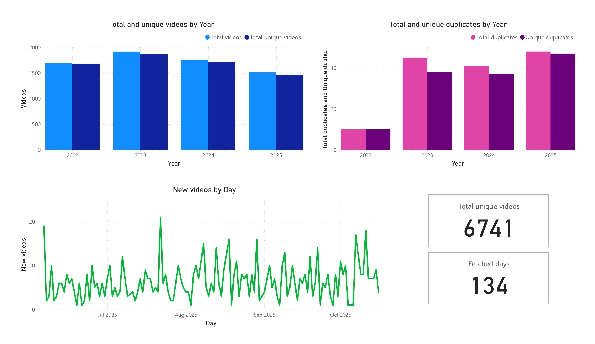
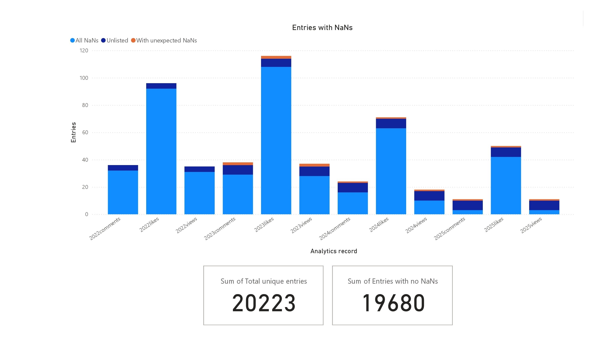

# K-Pop Analysis

This repository contains my analysis of song release and analytics data from the database I have previously fetched in this project: [K-Pop Release Database with Daily Analytics](https://github.com/mjgarciamoran/kpop_release_database).

---

## Preliminary data quality assessment

First we do a health check of the data. After verifying that data has been fetched everyday I check for duplicates and nans.

### Deduplication

  
  <!--  -->

Example of the first and last pages of the leaderboard of a particular gamemode and region.

### NaNs

We differentiate between 3 types of entries.
All nans
Unlisted during fetching
Unexpected nans, isolated

  
  <!--  -->

Example of the first and last pages of the leaderboard of a particular gamemode and region.

Bear in mind that each video corresponds to 3 entries, one in each analytic record, so 6741*3 = 20223

Additionally, there's already some conclusions we can infer from this data, specifically from the discrepancies in entries with all nans between different types of analytics.
For example, the amount of entries with all nans in the views analytic records determines the amount of unlisted (unpublished, turned from public to private) videos, since there's no other way to make views private.
On the other hand, comments and likes can be manually made private. This allows us to know how many videos have been unlisted, how many have had likes private and how many had had comments private.

<!--
## Secondary data quality assessment

discrepancies between kpopping dates and youtube dates

deleted analytics by youtube

-->
